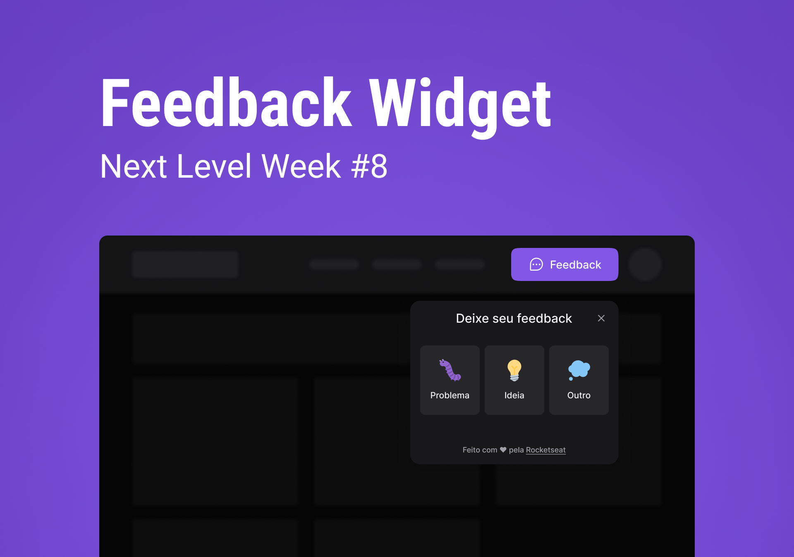

<h1 align="center">
    <!--  -->
    🚧 Feedback Widget
</h1>

 <a href="#-demonstration">Demonstration</a> |
 <a href="#-deploy">Deploy</a> |
 <a href="#-technologies">Technologies</a> |
 <a href="#-inspiration">Inspiration</a> |
 <a href="#-clipboard-pré-requisitos">Clipboard</a> |
 <a href="#-settings">Settings</a>

---

Feedback Widget é um projeto que foi desenvolvido durante o evento NLW Return da [Rocketseat](https://www.rocketseat.com.br/), onde foi desenvolvida a parte do `Front-end`, `Back-end` e `Mobile` de uma aplicação que serve para captar o Feedback dos usuário em relação a alguma funcionalidade do site/app, além de poder tirar um screenshot da aba/tela do momento do usuário, e por fim também é realizado o envio dos e-mails de Feedbacks dos usuário para uma conta de gerenciamento de e-mails.

* Caso goste do projeto marque a estrelinha⭐ e compartilhe para me ajudar 👍, e me siga para ver outros projetos meus.

## 📷 Demonstration

### 💻 Desktop

    

<!-- ### 📱 Mobile 

    

 -->

## 💻 Deploy

Clique no link a seguir para executar o projeto na sua máquina: <a target="_blank" href="https://git-hub-profile-delta.vercel.app/">Link</a>

## 🚀 Technologies

* Front-end

✔ [Vite](https://vitejs.dev/)
 
✔ [ReactJS](https://reactjs.org/)
 
✔ [TypeScript](https://www.typescriptlang.org/)
 
✔ [Tailwind CSS](https://tailwindcss.com/)
 
✔ [Axios](https://axios-http.com/docs/intro)
 
✔ [Phosphor Icons](https://phosphoricons.com/)
 
✔ [Headless UI](https://headlessui.dev/)
 
✔ [html2canvas](https://html2canvas.hertzen.com/)
 
✔ [html2canvas](https://html2canvas.hertzen.com/)
 

* Back-end

✔ [Express](https://expressjs.com/pt-br/)
 
✔ [Cors](https://www.npmjs.com/package/cors)
 
✔ [Prisma](https://www.prisma.io/)
 
✔ [Nodemailer](https://nodemailer.com/about/)
 
✔ [TypeScript](https://www.typescriptlang.org/)
 
✔ [ts-node-dev](https://www.npmjs.com/package/ts-node-dev)
 
✔ [Jest](https://jestjs.io/)
 

* Mobile

✔ [React Native](https://reactnative.dev/)
 
✔ [Expo](https://expo.dev/)
 
✔ [TypeScript](https://www.typescriptlang.org/)
 
✔ [Phosphor Icons](https://phosphoricons.com/)
 
✔ [Bottom Sheet](https://github.com/gorhom/react-native-bottom-sheet)
 
✔ [Axios](https://axios-http.com/docs/intro)
 

## 🔖 Layout

Você pode visualizar o layout do projeto através [desse link](https://www.figma.com/community/file/1102912516166573468). É necessário ter conta no [Figma](https://www.figma.com/) para acessá-lo

## 📋 Clipboard (Pré-requisitos)

Antes de baixar o projeto você vai precisar ter instalado na sua máquina as seguintes ferramentas:
    * [Git](https://git-scm.com)
    * [NodeJS](https://nodejs.org/en/)
    * [Yarn](https://yarnpkg.com/) ou [NPM](https://www.npmjs.com/)
    * Ambiente pré-configurado para desenvolvimento com React Native, vejo como [neste link](https://reactnative.dev/docs/environment-setup)

## ⚙ Settings

Segue os comandos para baixar e executar o projeto na sua máquina:🚧 Em andamento
    <!-- * `git clone` + `URL do Projeto`: clonar este repositório.
    * `cd Github-Profile`: acessa a pasta do projeto no terminal.
    * `yarn`: para baixar as dependências do projeto.
    * `yarn dev`: 
        - Executa o projeto em modo/ambiente de desenvolvimento.
        - Abra [http://localhost:3000](http://localhost:3000) para ver o projeto rodando no Navegador.
        - A página será recarregada se você fizer edições no código, e se tiver algum erro será mostrado no console.
    * `yarn build`: 
        - Compila a aplicação para a produção na pasta `build`. -->

## 📝 License

Esse projeto está sob a licença MIT. Veja o arquivo [LICENSE](LICENSE) para mais detalhes.

## ✍ Author

    Made with 💜 by PabloXT14

    
    

